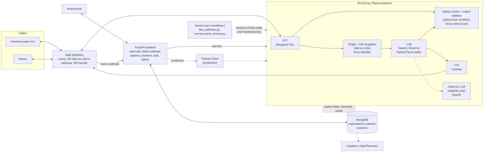

# OptimalBot Portal

Voice AI agent for healthcare phone calls: it places outbound calls to insurance payers for eligibility verification and answers inbound patient calls for scheduling, prescription status, and lab results, navigating phone trees and handing off to staff, plus a web portal to run and review calls.

Portfolio project. Code is shared to show the architecture and eval design; running it requires your own API keys.

## Architecture



A call starts when the portal posts to `/start-call` (dial-out) or Daily posts to `/dialin-webhook/{organization}/{workflow}` (dial-in). The backend creates a session and starts the bot, locally or through Pipecat Cloud. The bot builds a Pipecat pipeline from the workflow's `services.yaml`: Deepgram Flux speech-to-text, an OpenAI LLM driven by Pipecat Flows nodes, and Cartesia text-to-speech over a Daily room. Dial-out calls add Groq triage and IVR navigation in front of the conversation, and some workflows add safety monitoring or an observer LLM. When the call ends, the bot saves the transcript, usage, and call status to MongoDB.

## Workflows

Defined for the demo organization in `clients/demo_clinic_alpha`. Every call writes its transcript and call status to a session record in MongoDB.

- **eligibility_verification (dial-out).** Calls an insurance payer, classifies the answer as person, phone menu, or voicemail, navigates menus, and leaves a callback message on voicemail. With a representative it collects plan, network, date, coverage, deductible, and reference number details, which a silent observer LLM extracts into the patient record.
- **patient_scheduling (dial-in).** Handles new and returning patients (date-of-birth check), offers two generated appointment slots, and confirms the booking. Logs appointment fields on the patient record.
- **prescription_status (dial-in).** Verifies the caller, then reads the stored status of a GLP-1 prescription and can record a refill or renewal request. Safety monitoring is on. Logs refill and renewal flags.
- **lab_results (dial-in).** Verifies the caller, reads a stored summary only when results are ready, and otherwise confirms a callback. Safety monitoring is on. Logs whether results were communicated and the callback number.
- **mainline (dial-in).** Answers practice questions from configured facts, routes callers to the other workflows within the same call, and transfers other requests to staff. Logs caller name, reason, and where the call was routed.

`clients/demo_clinic_beta` has one more patient_scheduling workflow, to show a second organization with its own prompts.

## Evaluation

Scenario evals live in `evals/<org>/<workflow>/` (a `run.py` and a `scenarios.yaml` each) and test conversation logic in text, with no audio or telephony. A run seeds a synthetic patient into a test MongoDB database, loads the workflow's real flow class, and lets a simulated caller (`gpt-4o-mini`) follow the scenario's persona against it. Function handlers run for real against the test database. Graders then score the result: rule checks (node reached, database state, safety detection, forbidden phrases, extracted data) and Claude LLM judges (conversation quality, HIPAA behavior, routing). Triage evals under `evals/demo_clinic_alpha/eligibility_verification/triage/` test greeting classification and IVR navigation separately. `evals/ivr_deprecated` is retired.

Workflow evals need `OPENAI_API_KEY`, `ANTHROPIC_API_KEY`, and a MongoDB instance (`MONGO_URI`); Langfuse keys are optional. Each `run.py` supports `--list` (no API calls), `--scenario <id>`, `--all`, `-v`, and `--sync-dataset`.

## Multi-tenant design

An organization is a folder under `clients/` plus a document in the MongoDB `organizations` collection. A workflow is a subfolder with a `flow_definition.py` (a class named after the folder, which `FlowLoader` finds by convention), a `services.yaml` with `${VAR}` placeholders for keys, and a `schema.py` describing its fields for the portal. `python scripts/new_client.py --org-slug <slug> --workflow-name <name> --flow-type dialin|dialout` scaffolds the folder.

## Setup and deployment

Requires Python 3.12 or newer, [uv](https://docs.astral.sh/uv/), Node.js 20, and MongoDB. Running calls needs your own API keys; `.env.example` lists every variable.

```bash
cp .env.example .env
./setup-local.sh                  # creates .venv with uv
cd frontend && npm install

source .venv/bin/activate
ENV=local python app.py           # backend, port 8000
ENV=local python bot.py           # bot, port 7860
cd frontend && npm run dev        # portal, port 3000
```

Deployment is in `deploy.sh`: the backend to Fly.io, the bot (Docker image) to Pipecat Cloud, and the frontend with `cd frontend && vercel --prod`.

```bash
./deploy.sh test                  # backend and bot to the test environment
./deploy.sh prod backend          # one component to production
```

## Data

All patient data in this repository is synthetic.
