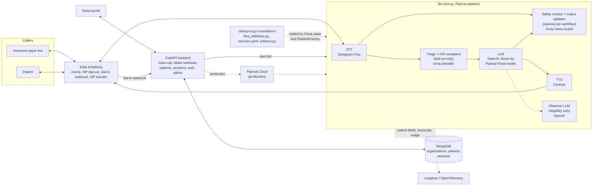

# OptimalBot Portal

Voice AI agent for healthcare phone calls: it places outbound calls to insurance payers for eligibility verification and answers inbound patient calls for scheduling, prescription status, and lab results, navigating phone trees and handing off to staff, plus a web portal to run and review calls.

Portfolio project. Code is shared to show the architecture and eval design; running it requires your own API keys.

## Healthcare workflows

The workflows below are defined for the demo organization in `clients/demo_clinic_alpha`. Every call writes its transcript to a session record in MongoDB, along with usage and cost figures. The call status values come from `backend/constants.py`: Not Started, Dialing, In Progress, Completed, Failed, Supervisor Dialed, Voicemail.

- **eligibility_verification (dial-out).** Calls an insurance payer's provider line, using the insurance phone number on the patient record. A classifier decides whether a person, a phone menu, or voicemail answered. It presses keys or speaks to get through menus, and leaves a callback message on voicemail. With a representative, it collects plan type, network status, effective and term dates, CPT coverage (covered, copay, coinsurance, deductible applies, prior authorization, telehealth), individual and family deductible and out-of-pocket figures, allowed amount, the representative's name, and a reference number. A second, silent LLM extracts these fields from the conversation into the patient record, and a final pass fills fields still missing when the call ends. Logged: the extracted fields on the patient record, the transcript, and the call status (In Progress, Completed, Voicemail, Failed, or Supervisor Dialed when the representative asks for a manager and the call is transferred to staff).
- **patient_scheduling (dial-in).** Asks whether the caller is a new or returning patient. Returning callers are looked up by phone number and verified by date of birth; two failed attempts transfer the call to staff. The bot asks for the visit reason, offers two appointment slots, collects first and last name, phone, date of birth, and email, and reads the booking back for confirmation. The slots are generated from the current date in code; there is no calendar integration. It can also hand the conversation off to text messaging. Reschedule, cancel, billing, insurance, and urgent requests go to staff. Logged: appointment fields on the patient record (a new record is created for new patients), session fields (status, identity verified, patient), the transcript, and the call status.
- **prescription_status (dial-in).** Verifies the caller by phone number and date of birth, then asks which medication they mean. The medication list in `schema.py` is five GLP-1 drugs (Ozempic, Wegovy, Mounjaro, Zepbound, Trulicity), with spoken aliases. It reads the status stored on the patient record: sent to pharmacy, pending prior authorization, ready for pickup, too early to refill, refills available, or needs renewal. It can record a refill request or a renewal request on the patient record; it does not contact a pharmacy. Safety monitoring is on: an emergency phrase triggers the 911 message and a staff transfer, and every bot reply is checked before it is spoken. Logged: refill and renewal flags, identity verified, the transcript, and the call status.
- **lab_results (dial-in).** Verifies the caller by phone number and date of birth. If the record shows results ready, it offers to read the stored summary. If results are pending, or the record is flagged for provider review, it does not read results and confirms a callback instead (default window "24 to 48 hours"). If there are no results, it transfers to staff. The caller can change the callback number. The same safety monitoring as prescription_status is on. Logged: results communicated, callback confirmed, updated callback number, identity verified, the transcript, and the call status.
- **mainline (dial-in).** The clinic's main line. It answers practice questions from configured facts (office hours, location, parking, website, and similar), routes callers to scheduling, lab results, or prescription status inside the same call with the stated reason carried over, and transfers billing, callback, and other requests to staff. It does not verify identity itself. Logged on the session: caller name, call reason, call type, where the call was routed (for example "scheduling (AI)" or "Answered Directly"), status, and the transcript.

`clients/demo_clinic_beta` contains one more dial-in workflow, patient_scheduling, to show a second organization with its own prompts and services.

## Architecture



How a call moves through the system:

- **Dial-out.** The portal calls `POST /start-call`. The backend checks that the workflow is enabled for the organization, creates a session, and starts the bot: locally by posting to `http://localhost:7860/start`, in production through the Pipecat Cloud API. The bot joins the Daily room and dials the number, with up to three attempts.
- **Dial-in.** Daily posts to `/dialin-webhook/{organization}/{workflow}`. The backend creates a session and starts the bot. The flow looks up the patient by the number the caller gives and verifies the date of birth.
- **Pipeline.** `pipeline/pipeline_factory.py` builds the processor chain from the workflow's `services.yaml`: Daily input, Deepgram Flux speech-to-text, a transcript logger, optional safety monitor, triage and IVR detection (dial-out only), the OpenAI LLM, IVR navigation, optional output validator, Cartesia text-to-speech, Daily output. When an observer LLM is configured, a parallel branch extracts data without speaking. Deepgram Flux handles turn detection.
- **Flow control.** Each workflow is a set of Pipecat Flows nodes (`role_messages`, `task_messages`, functions, pre and post actions). A function returns a result and the next node. Transfers to staff use a Daily SIP transfer.
- **After the call.** The bot saves the transcript and usage costs to the session and updates the patient's call status.

## Evaluation

Scenario-based evals live in `evals/<org>/<workflow>/`, one folder per workflow, each with a `run.py`, a `scenarios.yaml`, and a `results/` folder of past runs. They test the conversation logic in text: no audio, telephony, or STT/TTS is involved.

How a run works:

1. The runner seeds a synthetic patient from the scenario's `patient` block into a test MongoDB database (`alfons_test`, fixed test organization id) using `evals/fixtures.py`.
2. It loads the workflow's real flow class and the LLM settings from its `services.yaml`, and walks the Flows nodes. Function handlers run for real against the test database. `evals/context.py` reproduces the Flows context strategies (append, reset, reset with summary) offline.
3. A simulated caller (`gpt-4o-mini`), prompted with the scenario's `persona`, talks to the bot.
4. Graders score the result. Some are rules: node reached, expected database state, safety detection, forbidden phrases, extracted-data accuracy. Others are LLM judges (Claude, `claude-sonnet-4-20250514`, hardcoded in each `run.py`): conversation quality, HIPAA behavior, routing, and function-call appropriateness.
5. The result is written to `results/<scenario_id>/<timestamp>.json` and `.txt`, and a trace is sent to Langfuse when Langfuse keys are set. The `results/` folders contain output files from earlier runs.

What each workflow's scenarios cover:

| Workflow | Scenarios | What they test |
|---|---|---|
| eligibility_verification | 15 | Rep personas (rushed, jargon-heavy, system-down, self-correcting, high-deductible plans, uncomfortable with AI). Checks captured fields and cents-level amounts, handling of corrections, saying "I don't have that" for information it lacks, forbidden phrases, and golden responses. |
| patient_scheduling | 8 | Returning and new patients, ambiguous new/returning answers, failed date-of-birth check, reschedule request, urgent staff request, garbled transcription, unavailable slot. |
| prescription_status | 8 | Identity check before sharing anything, ambiguous generic names, failed verification, refill submission, early refill exception, emergency detection, misheard phone number, retry with a different number. |
| lab_results | 8 | Identity check before sharing results, failed verification, results held for provider review, no results on file, frustrated caller, emergency detection, misheard phone number, retry. |
| mainline | 12 | Routing and context handoff to the other workflows, multiple intents, indirect requests, persistent requests for a human, outside-capability requests (check-in, callbacks), claim disputes, urgency, language barrier. |

demo_clinic_beta has one patient_scheduling scenario.

Triage evals, under `evals/demo_clinic_alpha/eligibility_verification/triage/`, test the dial-out front end separately from the conversation. `evals/triage/common.py` holds the shared helpers: scenario loading, event and frame collectors, DTMF/spoken-text/status graders, and result saving.

- `classification`: 41 greetings that must be classified as CONVERSATION, IVR, or VOICEMAIL by the flow's classifier prompt on the Groq classifier model.
- `ivr_navigation`: 25 multi-step phone menus; checks the key presses or spoken replies, and the final status, against the expected path.

To run them, from the repository root with the virtual environment active:

```bash
python evals/demo_clinic_alpha/prescription_status/run.py --list          # list scenarios, no API calls
python evals/demo_clinic_alpha/prescription_status/run.py --scenario 1    # one scenario
python evals/demo_clinic_alpha/prescription_status/run.py --all           # all scenarios
python evals/demo_clinic_alpha/prescription_status/run.py --scenario 1 -v # also print the full LLM context
python evals/demo_clinic_alpha/prescription_status/run.py --sync-dataset  # push scenarios to a Langfuse dataset
python evals/demo_clinic_alpha/eligibility_verification/triage/classification/run.py --all
python evals/demo_clinic_alpha/eligibility_verification/triage/ivr_navigation/run.py --all
```

Keys and services needed:

- Workflow evals: `OPENAI_API_KEY` (bot LLM, caller simulator, safety classifier), `ANTHROPIC_API_KEY` (LLM judges), and a MongoDB instance reachable through `MONGO_URI`. The runners write to the `alfons_test` database. `LANGFUSE_PUBLIC_KEY` and `LANGFUSE_SECRET_KEY` are optional; without them the Langfuse client logs that it is disabled.
- Triage `classification`: `GROQ_API_KEY`. The runner loads the eligibility `services.yaml` with environment substitution, so `OPENAI_API_KEY`, `DEEPGRAM_API_KEY`, `CARTESIA_API_KEY`, `DAILY_API_KEY`, and `DAILY_PHONE_NUMBER_ID` must also be set (any non-empty value works for the ones it does not call).
- Triage `ivr_navigation`: `OPENAI_API_KEY`, plus the same set of variables for the substitution.

All of these call paid APIs. The `--list` option works without keys. `evals/ivr_deprecated` is retired.

## Multi-tenant design

An organization is a folder under `clients/` and a document in the MongoDB `organizations` collection, identified by its slug. A workflow is a subfolder with a `flow_definition.py` containing a class named after the folder (`patient_scheduling` becomes `PatientSchedulingFlow`), a `services.yaml` (call direction, STT/LLM/TTS settings, transfer number, with `${VAR}` placeholders for keys), and a `schema.py` describing the workflow's fields for the portal. `FlowLoader` finds the class by that naming convention, so there is no registry to edit. `python scripts/new_client.py --org-slug <slug> --workflow-name <name> --flow-type dialin|dialout` scaffolds the folder, and `scripts/workflow_schema.py` applies a workflow's `schema.py` to the organization document. To add a clinic or workflow, add the `clients/` folder, enable the workflow on the organization, and add a matching `evals/<org>/<workflow>/` folder with a `run.py` and `scenarios.yaml`; copying an existing workflow's eval folder is the quickest start. Dial-in numbers point at `/dialin-webhook/<org slug>/<workflow>`.

## Setup and deployment

Requirements: Python 3.12 or newer, [uv](https://docs.astral.sh/uv/), Node.js 20, and a MongoDB database.

```bash
cp .env.example .env              # fill in the keys; every variable is documented in the file
./setup-local.sh                  # creates .venv with uv; also regenerates the uv.*.lock files
cd frontend && npm install
```

`./setup-local.sh` runs `uv lock --upgrade`, so it rewrites the three lockfiles with the newest allowed versions. CI installs from the committed `uv.local.lock` instead.

`./run.sh` validates the environment, resets the eval patients in the `alfons` database, and starts the backend (port 8000), the bot (port 7860), the frontend (port 3000), and a marketing site. The marketing site is not part of this repository: the script expects it in `../marketing` with its `node_modules` installed, and exits if it is missing. Without it, start the three services yourself in separate terminals:

```bash
source .venv/bin/activate
ENV=local python app.py           # backend
ENV=local python bot.py           # bot
cd frontend && npm run dev        # portal
```

The portal sends signed-out users to the login page set by `VITE_LOGIN_URL` (default `https://optimalbot.ai/login`), which is the separate marketing site, so signing in locally also needs that site.

Environment modes: `ENV=local` makes the backend call the local bot at `http://localhost:7860/start`; `ENV=production` calls the Pipecat Cloud API and requires `PIPECAT_API_KEY`. `test` behaves like production.

Deployment is driven by `deploy.sh`:

- Backend: Fly.io (`fly.toml`, `fly.test.toml`, `Dockerfile.api`). `deploy.sh` copies selected variables from `.env` to Fly secrets.
- Bot: a Docker image built from `Dockerfile.bot` and deployed to Pipecat Cloud (`pcc-deploy.toml`, `pcc-deploy.test.toml`). The bot needs `OPENAI_API_KEY`, `GROQ_API_KEY`, `DEEPGRAM_API_KEY`, `CARTESIA_API_KEY`, `DAILY_API_KEY`, `DAILY_PHONE_NUMBER_ID`, and `MONGO_URI` in its Pipecat Cloud secret set. `sync-secrets.sh` uploads from `.env`, but its list does not include `DAILY_PHONE_NUMBER_ID`, so set that one yourself.
- Frontend: Vercel (`cd frontend && vercel --prod`).

```bash
./deploy.sh test                  # backend and bot to the test environment
./deploy.sh prod backend          # one component to production (asks for confirmation)
```

Repository layout:

| Path | Contents |
|---|---|
| `backend/` | FastAPI app: auth, patients, sessions, call start and dial-in webhook, admin, onboarding |
| `frontend/` | React portal (Shadcn/Radix, Tailwind) |
| `pipeline/` | Pipecat pipeline assembly, IVR and triage processors, safety processors, observer |
| `clients/` | Per-organization, per-workflow flows and service configs |
| `handlers/` | Transport, transcript, triage, and safety event handlers |
| `core/` | Flow loader |
| `evals/` | Scenario-based evals and triage evals |
| `docs/` | Design notes on the parallel function-call pipeline and prompt writing, plus sample call scripts |

## Data

All patient data in this repository is synthetic: the sample patients in `patients.csv`, the patient records in the eval `scenarios.yaml` files, and the sample call scripts in `docs/sample_calls`. The phone numbers in `patients.csv` are fictional 555 numbers.
